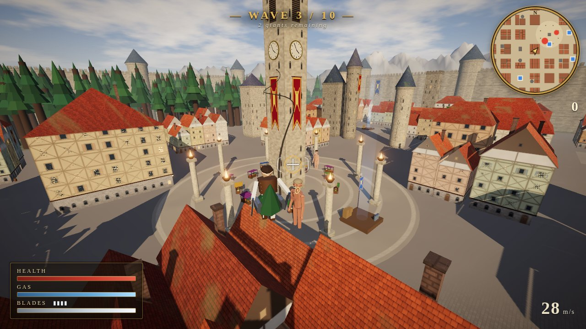

# Skyhook

A browser-based 3D action game set in the walled medieval town of Aldmere. You're a soldier with a dual grappling-hook harness powered by compressed gas. Giants (4–15 m tall) have broken through the south gate. Swing between half-timbered houses, stone towers and the cathedral bell tower, build up speed, and cut each giant down with a strike to the small weak point on the back of its neck.

Built with Three.js and Vite. Every model, texture and sound is procedural or built from primitives, with no external assets. Inspired by *Attack on Titan*.



## Play

- **Online:** once GitHub Pages is enabled (see [Deploying](#deploying-to-github-pages)), the game is served at `https://<user>.github.io/<repo>/`.
- **Locally:** `npm install && npm run dev`, then open the printed URL.

Click **PLAY** to lock the mouse. **Esc** pauses.

## Controls

| Action | Default | Notes |
| --- | --- | --- |
| Fire left / right hook | **Left / Right mouse** | Fires toward the crosshair (a gold marker shows where it will bite). **Hold** to reel that hook in (uses gas). |
| Gas boost | **Space** (hold) | Thrust toward your anchors. With no hooks attached it's an air dash; on the ground, a jump. |
| Release hooks | **Shift** | Let go and keep your momentum, plus a small slingshot boost at speed. |
| Swing steering / walk | **W A S D** | Relative to the camera. On a rope, pushes you along the swing arc. |
| Slash | **E** | Tap to swing, or hold to keep the blades out for up to 0.45 s. |
| Swap blades | **R** | Uses one spare pair. |
| Struggle (when grabbed) | **Space** (mash) | Slashing counts double. |
| Pause | **Esc** | |
| Perf overlay | **F3** | FPS, draw calls, triangles, resolution scale. |

Every action except pause can be rebound (keyboard or mouse button) in **Settings**.

### How to play

1. Aim at a building. The crosshair ring lights up and a gold marker appears on the surface when an anchor is in range (110 m). Fire a hook, then hold its button to reel in. The brackets either side of the crosshair show each hook's state: dim (idle), flickering (in flight), gold (attached), bright (reeling).
2. Swing: rope tension turns your fall into a pendulum arc, and **W A S D** pushes you along it. Release (**Shift**) near the top of the arc for a slingshot boost and fire the other hook at the next building. **Space** adds thrust.
3. Reeling in to a wall brakes you smoothly as you arrive, so you can zip up to a rooftop without crashing. Gas recharges to 45 % on its own when you stop using it for a moment.
4. Giants die **only** from a cut to the nape, on the back of the neck and marked in dark red. Damage scales with your speed: a 4 m giant falls at ~14 m/s, but a 15 m giant needs a ~35 m/s pass with fresh blades.
5. Limb hits stagger giants. Enough damage severs the limb: a severed leg makes the giant crawl, and a severed arm can't grab. Limbs regrow after 18 s.
6. A giant that glows red is winding up. A HUD arrow points at it, labelled **GRAB!** or **SWIPE!**. Grabs come from the front, so stay behind or above. If you're grabbed, mash Space before it bites.
7. Blades dull with every strike, and damage falls off as they do. Swap with **R**.
8. Land on a **supply depot** (blue beacon, blue squares on the minimap) and stand still for a moment to refill gas and blades and patch up 35 HP.

## Features

**Grapple movement**
- Two independent hooks, each a fast projectile (340 m/s) that anchors to buildings, towers, trees, market stalls, the wall or the giants themselves (anchors on giants follow the moving body part).
- Rope physics: each rope is a max-length constraint with an auto-winch. Swinging is true pendulum motion with momentum preserved, with reduced air drag while on a rope. Per-hook reel, gas boost toward the anchors, air dash, and a lift-off hop from the ground.
- **Swing steering:** W A S D push along the swing arc (perpendicular to the rope), so you can curve around corners and pump a swing higher without fighting the rope.
- **Soft arrival:** reeling toward a static anchor caps your approach speed to what can still brake before the wall, and bleeds off the sideways spin a shortening rope would otherwise build up. You zip in fast and land gently. Reeling into a giant keeps full speed, so reel-in nape strikes stay powerful.
- **Slingshot release:** letting go of a taut rope at speed adds a small boost along your motion.
- **Aim feedback:** a 3D marker on the surface shows exactly where a hook will bite (red on giants, bright red on a nape), hook-status brackets on the crosshair, and a wider three-ring aim assist.
- A gas tank that drains on boost, reel and firing, recharges to 45 % after a short pause, and refills fully while standing still. Low-gas warning.
- Ropes render as ribbons that whip out while the hook flies and twang when it bites.
- Third-person camera with smoothing, look-ahead along your velocity, a gentle bank into sideways motion, collision pull-in that eases back out, FOV widening and speed lines at high speed, and trauma-based camera shake.

**Combat**
- Dual blades with durability and 4 spare pairs. Slash damage scales with impact speed, blade sharpness and body part.
- A small nape weak point is the only kill zone. Limbs can be severed, the giant's body blocks you physically, and crashing into walls faster than 38 m/s hurts.
- Hit feedback: hit-stop, a slow-motion beat on kills, camera shake, floating damage numbers, a KILL banner with style tags, a screen flash, blade-arc trails, and steam and blood-mist particles.

**Giants**
- Procedural low-poly giants with randomized, uncanny proportions and faces.
- AI state machine: wander → detect (line of sight) → pursue → telegraphed grab or swipe → recover, with stagger interrupts. Obstacle avoidance lets them move through the street grid.
- Grab and escape: 35 damage plus crush damage, a mash-to-escape meter, and a bite if you're too slow.
- Variants: small, medium, large, and an **abnormal** that zigzags, twitches, sprints in bursts, winds up faster and always knows where you are.

**World: the medieval town of Aldmere**
- A seeded, procedural walled town: rows of narrow half-timbered houses with stone ground floors, jettied upper floors, shutters, chimneys and steep clay-tile roofs; guild halls; round stone towers with slate cones; crenellated keeps; and a market square with the 64 m cathedral bell tower (belfry and clock faces), fire-topped columns and striped market stalls.
- A 50 m curtain wall with crenellations and round towers, heraldic banners down its inner face, and a broken south gate where giants pour in. A pine forest fills the northern edge; fields, woods and snow-capped mountains lie beyond the wall.
- Street life: barrels and crates, wall lanterns, chimney smoke, embers from the braziers, banners waving in the wind, and birds circling the bell tower.
- Four supply depots with light-beam beacons.

**Rendering**
- Golden-hour lighting: a low warm sun with soft shadows, a sky dome with drifting procedural clouds, and an environment map baked from that sky for PBR ambient light.
- All surfaces are procedural shaders with no textures: timber framing, windows (a few lit warm), ashlar stone, clay tiles and slate with moss, cobbled streets with a fan-laid market square. Patterns fade out by screen-space derivative so distant facades don't shimmer.
- Sun-tinted height fog: denser near the ground and glowing warm toward the sun, matched exactly to the sky horizon.
- Post-processing (medium/high quality): HDR bloom, ACES tone mapping, a warm/cool colour grade, vignette, and edge desaturation when badly hurt.

**Game loop and UI**
- Wave mode: 10 escalating waves (large giants from wave 3, abnormals from wave 4), trickle spawns, intermissions, and victory.
- Scoring: kill value by variant, a speed bonus, style bonuses (AIRBORNE, ONE CUT, CLOSE CALL), combo multiplier, wave-clear and time bonuses. The best score is saved.
- Main menu with a live town backdrop, How to Play, a pause menu, and a results screen with run stats and score breakdown.
- Settings: mouse sensitivity, invert Y, graphics quality (low/medium/high; low turns off post-processing and shadows), dynamic resolution, FOV and camera-bank effects, speed lines, volume, and full key rebinding. Saved to `localStorage`.
- HUD: health, gas and blade durability, spare blades, wave status, score and combo, speed, minimap, danger indicator, struggle meter, and resupply progress.

**Audio and polish**
- All sound is synthesized live with the Web Audio API: wind that rises with speed, gas hiss, hook zips, blade swishes, flesh impacts, steam, footsteps, roars, bells and more, all panned in stereo relative to the camera.
- Performance: an instanced town (every wall, roof, merlon, chimney, banner and stall shares a handful of draw calls), merged giant meshes, allocation-free hot paths, fog culling, texel-snapped shadows, and dynamic resolution to hold 60 fps.

## Build and run

Requires **Node.js 20+** (CI uses Node 22).

```bash
npm install        # install dependencies (three, vite, vitest)
npm run dev        # dev server with hot reload
npm test           # unit tests (Vitest)
npm run build      # production build into dist/
npm run preview    # serve the production build locally
```

The build uses a relative base path (`base: './'`), so `dist/` works from any sub-path, including a GitHub Pages project URL.

### Debug helpers

- `?autoplay` starts a run immediately and doesn't require pointer lock (handy for automated testing).
- `?fps` shows the perf overlay on load (same as **F3**).
- `window.__skyhook` exposes the `Game` instance in the browser console.

## Deploying to GitHub Pages

`.github/workflows/deploy.yml` runs the tests, builds, and publishes `dist/` to GitHub Pages on every push to `main` (it can also be run manually from the Actions tab). One-time setup:

1. In the repository, go to **Settings → Pages**.
2. Under **Build and deployment → Source**, choose **GitHub Actions**.
3. Push to `main` (or run the "Deploy to GitHub Pages" workflow). The URL appears in the workflow summary.

`.github/workflows/ci.yml` runs tests and the build on every other branch push and on pull requests.

## Project structure

```
src/
  core/      fixed-step loop, input (keys and mouse as rebindable codes), settings, math, seeded RNG, perf monitor
  world/     town generator (pure data), static colliders + raycasts, procedural materials, Three.js town view, supply depots
  render/    sky, fog and environment lighting; post-processing (bloom, grade, tone mapping)
  player/    kinematic player body, player model, third-person camera rig, crosshair aiming
  grapple/   pure rope math, hook state machine, grapple system (gas/reel/boost), rope rendering
  combat/    pure damage math, blades, slash resolution, hit feedback (numbers, banners, toasts)
  giants/    procedural rig + poses, giant entity, pure AI state machine, AI brain, manager
  game/      Game orchestrator, wave director, scoring
  ui/        HUD, minimap, menus, stylesheet
  audio/     procedural Web Audio engine
  fx/        particles, speed lines, slash trail
tests/       Vitest suites (rope physics, grapple system, damage and combat, AI transitions, waves and scoring, colliders and town layout)
```

### Architecture

- **Loop:** physics and gameplay run at a fixed 120 Hz with render interpolation. Input is read once per frame before the physics steps. A time scale drives hit-stop and slow motion.
- **Per step:** player intent → hooks (fly / attach / reel) → integrate the player (gravity, gas, steering, quadratic drag) → rope constraints → collision against the world and giant bodies → giant AI and animation → slash resolution → events. Events feed audio, particles, HUD and scoring.
- **Physics:** the player is a sphere, and the world is axis-aligned boxes plus vertical cylinders (round towers, wall towers, trees) on a uniform grid. Ropes are solved as position projection plus removal of outward radial velocity, which conserves tangential momentum (see `tests/ropeMath.test.js` for the pendulum period and energy checks).
- **Giants:** a bone hierarchy of `THREE.Group`s posed procedurally each step. Hitboxes are spheres in bone-local space, used for hook raycasts, slashes, body collision and grabs.

## Design decisions

- **Plain JavaScript + JSDoc** instead of TypeScript: less tooling, and the build stays a plain `vite build`.
- **Custom physics, no cannon-es.** The player is a kinematic sphere against axis-aligned boxes and vertical cylinders, so a hand-written solver is simpler and faster than a general physics engine.
- **Ropes are max-length constraints with an auto-winch.** A rope never lengthens. Slack is taken up automatically, so swinging is a pure pendulum that keeps its momentum. Ropes pass through geometry; there's no rope-wrapping.
- **Hold a hook button to reel that hook.** Clicking fires, holding reels (uses gas), Shift releases both. This keeps reeling per-hook without extra keys.
- **Swing steering is projected onto the swing arc.** WASD acceleration (24 m/s²) is the component of your input perpendicular to the rope, with any downward part dropped. Pushing into or away from the anchor never fights the rope, and steering can't drag you toward the ground.
- **Soft arrival is a kinematic braking cap.** While reeling toward a static anchor, approach speed is clamped to `2 + sqrt(2 × 55 × (dist − 1.5))`, i.e. what 55 m/s² of braking can still stop. Within a zone that grows with speed (7 m, or 0.3 s of travel) sideways motion is damped as well, because a rope shortening around a fast body otherwise conserves angular momentum and spins you into an orbit around the anchor. Giant anchors are exempt so reel-in nape strikes keep their speed. `tests/grappleSystem.test.js` checks that a 40 m reel-and-boost peaks above 20 m/s but arrives at under half the crash-damage speed.
- **Slingshot release:** releasing both ropes with Shift at more than 14 m/s adds 0.12 m/s per m/s above that (up to 6 m/s) along your velocity, plus 2.5 m/s of lift. Forced releases (grabs, swipes) never boost.
- **Lift-off hop:** reeling or boosting while standing on the ground pops the player into the air, so the rope swings them instead of dragging them along the floor.
- **Gas recharges passively, but only partway.** After 1.2 s without spending gas it refills at 4/s up to 45 % of the tank, and standing still on the ground refills it all the way (6/s), so an empty tank can never soft-lock a run. Supply depots still refill it completely in 1.2 s.
- **Aim assist:** if the crosshair ray misses, three rings of 12 probe rays (1.7°, 3.4° and 5.7°) look for a nearby anchor, tightest ring first. The anchor marker shows the result, so assisted shots are never a surprise.
- **Crash damage:** hitting a surface faster than 46 m/s hurts (0.9 HP per m/s above that), which rewards releasing before impact.
- **Slash is on `E`.** The mouse buttons belong to the hooks, so the slash needs its own key (rebindable).
- **Slash = short active window (0.14 s)** during which a 2.3 m sphere in front of the player is tested against giant hitboxes every physics step. Each giant can be hit once per slash, and the nape wins if it overlaps.
- **Damage = (10 + 3.2 × speed) × part multiplier × blade sharpness.** Nape health is 30 + 6 × height, so a 15 m giant needs a ~35 m/s pass with fresh blades to die in one cut, while a 4 m giant dies at ~14 m/s.
- **Giants are hitbox spheres on a procedural bone rig.** Hooks can anchor on any body part and follow it as it moves.
- **Severed limbs regrow after 18 s.** A severed leg cripples the giant (it crawls at 25 % speed); a severed arm can't grab.
- **Giants step over buildings shorter than 55 % of their height** and slide around taller ones. This avoids full pathfinding.
- **AI is a pure state machine** (`src/giants/aiStateMachine.js`) that returns the next state from a perception snapshot. The `GiantBrain` only executes behaviour, which keeps transitions unit-testable.
- **Grab over swipe:** when a grab is possible, giants close in to grab. They swipe only when the grab is on cooldown or the player is off to the side, and only at players high enough for the shoulder-level arc (in the air or on roofs).
- **Telegraphs:** windups last 0.95 s for grabs (0.55 s for abnormals) and 0.75 s for swipes. The giant pulses red and a HUD arrow points at it. Staggering a giant (any hit, or severing the attacking arm) cancels the windup.
- **Grab escape:** a grab deals 35 damage plus 4/s crush. Mash Space (a slash counts double) to break free before the 5 s bite (30 damage). Escaping grants 2.5 s of grab immunity.
- **Line of sight** is a throttled ray from the head (4 per second). Abnormals ignore it, and anything within 22 m is always "heard".
- **Steering** is probe-ray obstacle avoidance (a fan of headings around the goal) plus a stuck detector that forces a detour. There's no navmesh.
- **Ten waves, then victory.** Each wave grows in size and mix: large giants from wave 3, abnormals from wave 4. At most 7 giants are alive at once, and the rest trickle in every 2.5–5 s from the wall breach or the forest (whichever spawn points are more than 90 m from the player).
- **Healing:** supply depots also restore 35 HP, and clearing a wave restores 25 HP. Without this a 10-wave run would be decided by attrition rather than skill.
- **Scoring:** a kill scores the variant's base value plus a speed bonus (8 points per m/s above 20), plus style bonuses: AIRBORNE (≥ 4 s off the ground), ONE CUT, and CLOSE CALL (≤ 25 HP). Kills within 10 s of each other chain a combo multiplier (+0.25 each, capped at ×3). Wave clears add 250 × wave number plus a time bonus. Severs and escapes add small bonuses. The best score is kept in `localStorage`.
- **Resupply:** stand still on a depot platform for 1.2 s. There's no cooldown, since landing already costs you momentum.
- **Forgiving slashes at speed:** holding the slash key keeps the blades out for up to 0.45 s. If the nape will come into range within the next 0.08 s, the swing isn't spent on an arm or body part that happens to be closer first.
- **Kill beat:** a kill gets a hit-stop followed by 0.45 s of 35 % slow motion.
- **Audio is 100 % procedural** (Web Audio): wind and gas-hiss noise loops follow speed and boosting, and every effect is a small synthesized graph (filtered noise bursts, pitch-swept oscillators, LFO-modulated roars). There are no audio files. Distant sounds are attenuated and stereo-panned relative to the camera.
- **Procedural facades from instance data.** Each building box carries `(style, seed, plinth height, v offset)` in an instanced attribute; the shader derives face-local metres from the instance scale and lays out bays, floors, windows, doors and timber braces from that. Hundreds of buildings render in a few draw calls with no textures.
- **Fog is patched into three's shader chunks** (height falloff plus sun in-scattering) with the sun direction baked in as a constant, so every built-in material gets it without per-material uniforms.
- **Row houses instead of blocks:** deep lots are split into two back-to-back rows of 6–8.5 m wide houses. Jetties only overhang the street, never a neighbour; a layout test checks that no two footprints overlap.
- **Performance:** instanced city geometry, each giant's per-bone meshes merged by material (~35 → ~15 draw calls), preallocated raycast results (no per-frame garbage in aiming), giants beyond the fog hidden, shadow frustum snapped to texels, and **dynamic resolution** that steps the pixel ratio down when frames exceed 20 ms and back up when there's headroom. Press **F3** (or add `?fps`) for an FPS / draw-call overlay.
- **No license file is included.** Choosing a license is left to the repository owner.

## Credits

Code, geometry, shaders and sound are all generated procedurally in this repository. The game concept is an homage to *Attack on Titan*; no names, characters, art or audio from it are used.
